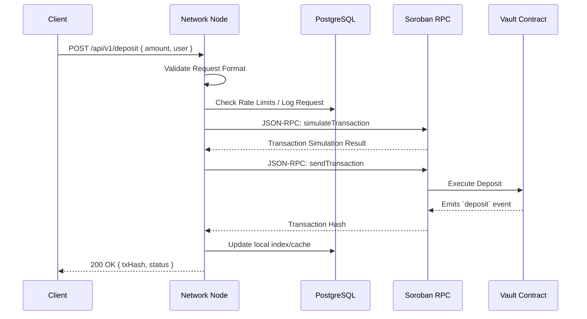
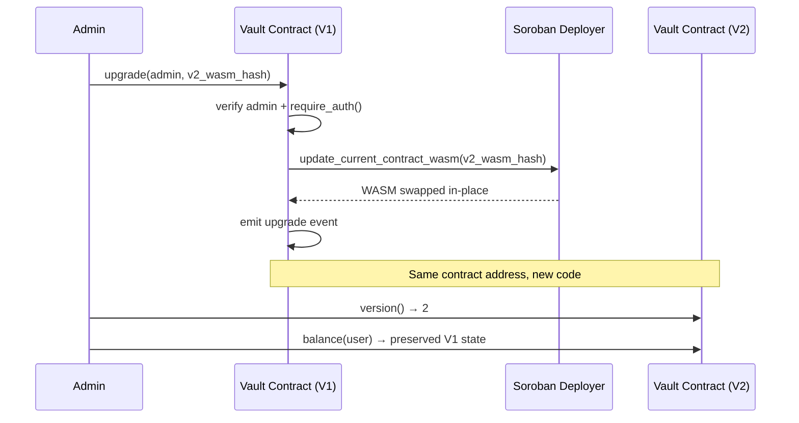

# Axionvera Network Architecture

This document provides a comprehensive overview of the Axionvera Network architecture to facilitate contributor onboarding. It details the network topology, component interactions, node communication mechanisms, and data dependencies.

## Network Topology

The Axionvera Network consists of a decentralized set of nodes interfacing with the Soroban smart contract network and a PostgreSQL database for off-chain state management. 

```mermaid
graph TD
    %% Define Nodes
    Client[Client Applications / dApps]
    ALB[Application Load Balancer]
    
    subgraph "Axionvera Network (AWS VPC)"
        API1[Network Node 1 (API)]
        API2[Network Node 2 (API)]
        Worker[Background Worker Node]
        
        DB[(PostgreSQL 15+)]
        Redis[(Redis Cache)]
    end
    
    subgraph "Stellar Network"
        Soroban[Soroban RPC]
        StellarCore[Stellar Core]
    end

    %% Connections
    Client -- "HTTPS (REST)" --> ALB
    ALB -- "HTTP (Port 8080)" --> API1
    ALB -- "HTTP (Port 8080)" --> API2
    
    API1 -- "TCP/IP (Port 5432)" --> DB
    API2 -- "TCP/IP (Port 5432)" --> DB
    Worker -- "TCP/IP (Port 5432)" --> DB
    
    API1 -- "TCP/IP (Port 6379)" --> Redis
    API2 -- "TCP/IP (Port 6379)" --> Redis
    
    API1 -- "JSON-RPC (HTTPS)" --> Soroban
    API2 -- "JSON-RPC (HTTPS)" --> Soroban
    Worker -- "JSON-RPC (HTTPS)" --> Soroban
    
    Soroban --- StellarCore
```

### Component Overview

- **Network Nodes (API)**: Rust-based Axum servers that handle incoming client requests, validate transactions, and interact with the database and Soroban RPC.
- **Background Worker Node**: Processes asynchronous tasks, such as reward distribution cron jobs or transaction finality monitoring.
- **Application Load Balancer (ALB)**: Distributes incoming HTTPS traffic across the active Network Nodes to ensure high availability.
- **Database (PostgreSQL)**: Stores off-chain metrics, cached user data, and request logs.
- **Redis Cache**: Optional component for rate limiting and session management.

## Node-to-Node Communication

While Axionvera nodes primarily act as independent gateways to the Soroban contract, they communicate with the database and internal services using structured protocols.

### Communication Mechanisms

1. **Client to Network Node**
   - **Protocol**: HTTPS / REST
   - **Message Format**: JSON payloads
   - **Handshake**: Standard TLS handshake followed by API key validation (if applicable).

2. **Network Node to Database**
   - **Protocol**: TCP/IP (Port 5432)
   - **Message Format**: PostgreSQL Wire Protocol
   - **Connection Pool**: Handled via `bb8` or `deadpool` with timeout management and graceful connection draining on shutdown.

3. **Network Node to Soroban RPC**
   - **Protocol**: HTTPS
   - **Message Format**: JSON-RPC 2.0
   - **Error Handling**: Implement circuit breakers. If Soroban RPC fails >10 times per minute, the node trips the breaker and falls back to a secondary RPC or returns a `503 Service Unavailable`.

### Component Interaction Data Flow



## Error Handling & Centralized Middleware

The Axionvera Network Node implements a centralized error handling middleware:
- **Error Types**: Mapped to unified enums (`NetworkError`, `DatabaseError`, `ValidationError`).
- **Circuit Breaker**: Prevents cascading failures when external services (like the Database or Soroban RPC) go down.
- **Response Format**: 
  ```json
  {
    "error": {
      "code": "VALIDATION_ERROR",
      "message": "Invalid amount specified",
      "request_id": "uuid-v4-string"
    }
  }
  ```

## Database Dependencies

The system relies on a relational database for caching, rate limiting, and analytics.

- **Engine**: PostgreSQL
- **Minimum Version Requirements**: 15.0+
- **Driver**: `tokio-postgres` (via connection pooling)

### Schema Descriptions

#### 1. `requests_log`
Tracks all incoming API requests for observability and rate-limiting.
- `id` (UUID, Primary Key)
- `endpoint` (VARCHAR)
- `status_code` (INTEGER)
- `duration_ms` (INTEGER)
- `created_at` (TIMESTAMP)

#### 2. `user_cache`
Caches vault user states to minimize RPC calls.
- `address` (VARCHAR, Primary Key)
- `cached_balance` (NUMERIC)
- `last_updated` (TIMESTAMP)

## Vault Contract Storage (On-Chain)

The core source of truth is the Soroban smart contract.

- **Global State (`Instance` storage)**:
  - `Admin`: Address
  - `TotalDeposits`: i128
  - `RewardIndex`: i128
- **User State (`Persistent` storage)**:
  - `UserBalance(Address)`: i128
  - `UserRewardIndex(Address)`: i128
  - `UserRewards(Address)`: i128

For detailed contract math and reward mechanics, see the contract specifications in `docs/contract-spec.md`.

## Contract Upgradeability (WASM Swap)

The vault contract supports in-place WASM upgrades, allowing the admin to replace the contract code while preserving all on-chain state. This is critical for deploying bug fixes without requiring users to migrate to a new contract address.

### How It Works

The contract exposes an `upgrade(env, admin, new_wasm_hash)` function that:

1. Verifies the contract has been initialized.
2. Requires `admin.require_auth()` — only the stored admin can authorize an upgrade.
3. Checks that the caller matches the stored admin address (double-check beyond Soroban auth).
4. Calls `env.deployer().update_current_contract_wasm(new_wasm_hash)` — the Soroban built-in that swaps the WASM code at the current contract address.
5. Emits an `upgrade` event with the admin address and the new WASM hash for auditability.

### Storage Compatibility

After an upgrade, the new WASM **must** use the same `DataKey` enum layout for instance and persistent storage. If the keys change, the upgraded contract will be unable to read existing state and user funds could be lost.



### Upgrade Procedure via Stellar CLI

1. **Build the new WASM**:
   ```bash
   cargo build --target wasm32-unknown-unknown --release -p axionvera-vault-contract
   ```

2. **Deploy the new WASM to the network**:
   ```bash
   soroban contract upload \
     --wasm target/wasm32-unknown-unknown/release/axionvera_vault_contract.wasm \
     --source admin \
     --network testnet
   ```
   This returns the new WASM hash (`<NEW_WASM_HASH>`).

3. **Invoke the upgrade function** on the existing contract:
   ```bash
   soroban contract invoke \
     --id <CONTRACT_ID> \
     --source admin \
     --network testnet \
     -- upgrade \
     --admin <ADMIN_ADDRESS> \
     --new_wasm_hash <NEW_WASM_HASH>
   ```

4. **Verify the upgrade** by calling `version()` or another function that distinguishes V2 from V1:
   ```bash
   soroban contract invoke \
     --id <CONTRACT_ID> \
     --network testnet \
     -- version
   ```

### Safety Considerations

- **Admin-only**: Only the address stored as `admin` in instance storage can call `upgrade`. If admin access is lost, the contract cannot be upgraded.
- **No state migration**: `update_current_contract_wasm` only swaps the code. It does not run any initialization logic in the new WASM. Any state migration must be handled by the new contract code explicitly.
- **Storage layout**: The new WASM must preserve the `DataKey` enum variant order. Adding new variants is safe; reordering or removing existing variants is not.
- **Event audit trail**: Every upgrade emits an `upgrade` event containing the admin and the new WASM hash, enabling off-chain monitors to detect and verify upgrades.
- **Test before deploying**: Always test the upgrade path on Futurenet before deploying to Testnet or Mainnet.

## Permission Delegation Layer

Axionvera includes a secure permission delegation layer that allows contracts and users to delegate specific operations to trusted modules while enforcing strict authorization boundaries.

### Overview

The delegation layer enables "Module-to-Module" or "User-to-Module" authorization. Instead of granting full administrative access, a delegator can grant a delegatee the right to call a specific function (operation) for a limited time.

### Key Components

- **`ContractDelegation` Trait**: Defines the interface for managing delegations (`delegate`, `revoke_delegation`, `get_delegation`, `is_authorized`).
- **`DelegationManager`**: A core utility that handles the storage and validation of `DelegationRule`s.
- **`DelegatedPolicy`**: An implementation of the `AccessPolicy` trait that allows easy integration of delegation checks into contract functions.

### Security Model

1. **Strict Authorization**: Every delegation action (`delegate` or `revoke_delegation`) requires the explicit authorization of the delegator via `require_auth()`.
2. **Time-Bound**: Delegations include an expiration timestamp. Once expired, the delegation is automatically considered invalid by the `is_authorized` check.
3. **Operation-Specific**: Delegations are scoped to a single `Symbol` representing the operation, preventing unauthorized access to other functions.
4. **Privilege Escalation Prevention**: By requiring `delegator.require_auth()`, we ensure that only the entity possessing the original permission can delegate it.

### Workflow

1. **Granting Delegation**: A delegator calls a contract's `delegate` function, providing the `delegatee` address, the `operation` symbol, and an `expiration` timestamp.
2. **Verification**: When the `delegatee` attempts to perform the operation, the contract uses `DelegatedPolicy` or `DelegationManager::is_authorized` to verify the rule exists and has not expired.
3. **Revocation**: A delegator can revoke a delegation at any time before it expires.

### Events

The delegation layer emits the following events for auditability:
- `deleg_g`: Emitted when a delegation is granted (Delegation Granted).
- `deleg_r`: Emitted when a delegation is revoked (Delegation Revoked).
