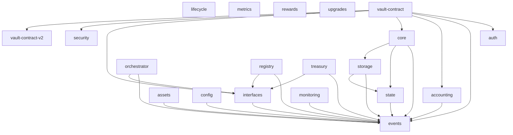

# Protocol Architecture Diagram

```mermaid
graph TD
    accounting[accounting] --> events[events]
    assets[assets] --> events[events]
    config[config] --> events[events]
    core[core] --> events[events]
    core[core] --> state[state]
    core[core] --> storage[storage]
    interfaces[interfaces] --> events[events]
    lifecycle[lifecycle]
    metrics[metrics]
    monitoring[monitoring] --> events[events]
    orchestrator[orchestrator] --> events[events]
    orchestrator[orchestrator] --> interfaces[interfaces]
    registry[registry] --> events[events]
    registry[registry] --> interfaces[interfaces]
    rewards[rewards]
    state[state] --> events[events]
    storage[storage] --> events[events]
    storage[storage] --> state[state]
    treasury[treasury] --> events[events]
    treasury[treasury] --> interfaces[interfaces]
    upgrades[upgrades]
    vault_contract[vault-contract] --> auth[auth]
    vault_contract[vault-contract] --> events[events]
    vault_contract[vault-contract] --> accounting[accounting]
    vault_contract[vault-contract] --> core[core]
    vault_contract[vault-contract] --> interfaces[interfaces]
    vault_contract[vault-contract] --> security[security]
    vault_contract[vault-contract] --> vault_contract_v2[vault-contract-v2]
```
